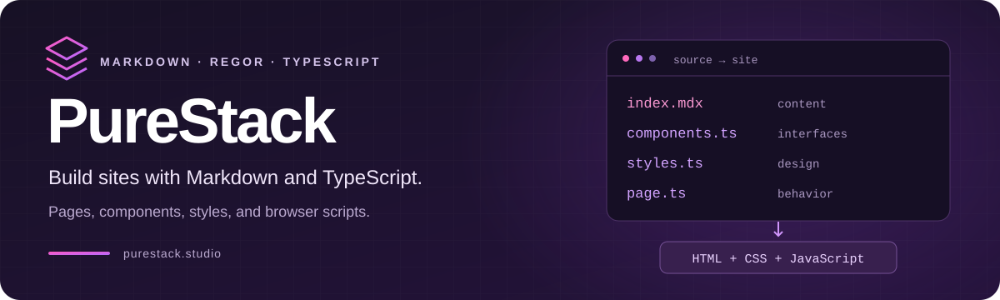
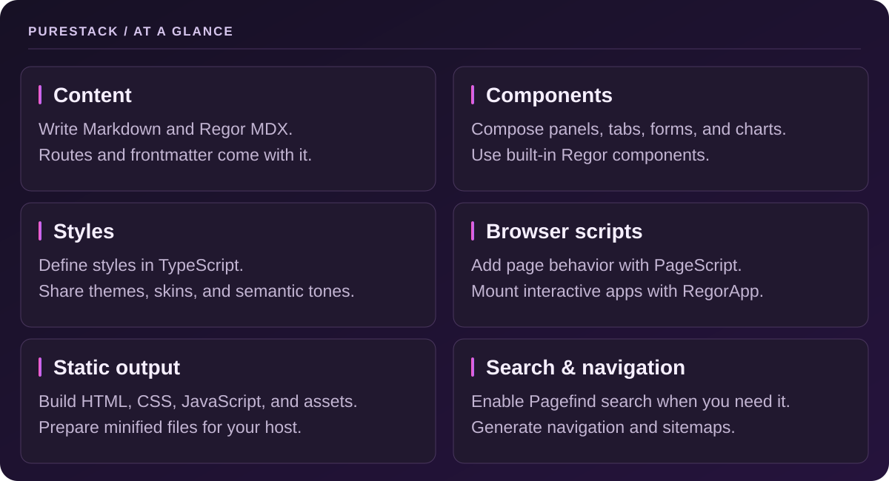

<div align="center">



# PureStack

**Build content sites and interactive pages from one coherent source model.**

Markdown for your content. TypeScript for your components, styles, and behavior.

[](https://www.npmjs.com/package/purestack)
[](https://github.com/PureStackStudio/PureStack/actions/workflows/ci.yml)
[](https://www.typescriptlang.org/)
[](LICENSE)

**[Explore the docs](https://purestack.studio/guides/)** ·
**[Browse components](https://purestack.studio/components/)** ·
**[See an example site](packages/ts-ssg/sample-content)** ·
**[Contribute](CONTRIBUTING.md)**

</div>

---

## Your content. Your components. One pipeline.

PureStack turns a content directory into a static website. Write pages in
Markdown or Regor MDX, use built-in components where they help, and add
browser-side TypeScript only where a page needs behavior. The CLI handles
routes, styles, assets, development preview, and release builds.



> **PureStack in practice:** [purestack.studio](https://purestack.studio) is built
> from the [frontend source in this repository](frontend).

## Why coherent source matters

Generating a first page is only the beginning. A product keeps changing:
new content, new components, new behavior, and new people working on it.

PureStack's architectural bet is that explicit, typed source makes that ongoing
work easier for humans and AI tools to inspect and reason about. Content
stays in Markdown; components, style builders, and scripts live in TypeScript.
The aim is a source model that remains understandable as the product grows.

`.mdx` and `.rmdx` pages use Regor components and expressions. Plain `.md`
files work for prose pages. See the [Regor guide](https://purestack.studio/guides/extending/regor/)
for the markup and browser app model.

## Get your first page running

### 1. Create a project

```sh
mkdir my-site
cd my-site
npm init -y
npm install purestack
mkdir content
```

### 2. Add your config and a page

Your starting point is just two files:

```text
my-site/
└── content/
    ├── siteConfig.json
    └── index.mdx
```

**`content/siteConfig.json`**

```json
{
  "siteTitle": "My Site",
  "logo": { "brand": "My Site", "href": "/" },
  "outDir": "../dist/site",
  "publishDir": "../dist/publish"
}
```

**`content/index.mdx`**

```mdx
---
title: Welcome
description: My first PureStack site.
template: doc
---

# Make something worth reading.

Start with Markdown. Add components when your page needs more.

<Panel tone="info" variant="surface">
  <p>Your first PureStack page, ready to make your own.</p>
</Panel>
```

### 3. Preview it

```sh
npx purestack serve --content ./content
```

Open <http://127.0.0.1:4173/>. Add `content/about.mdx` to create `/about/`.
The server watches your files and reloads the browser as you edit.

### 4. Build for your host

```sh
npx purestack build --content ./content
npx purestack publish --content ./content
```

`build` writes to `dist/site`. `publish` creates a clean, minified artifact in
`dist/publish`; it prepares files for deployment but does not upload them.
Both paths come from `siteConfig.json` and are resolved relative to `content`.

For browser behavior, add a TypeScript file beside a page and load it with
`<PageScript src="./example.ts" />`. The [purestack package README](packages/purestack/README.md)
has a complete example.

## Pick your next step

| I want to… | Start here |
| :--- | :--- |
| Configure a site | [Site configuration](https://purestack.studio/guides/getting-started/site-config/) |
| Build a richer page | [Component catalog](https://purestack.studio/components/) |
| Add browser behavior | [PageScript and RegorApp examples](packages/purestack/README.md) |
| Understand the CLI | [CLI guide](https://purestack.studio/guides/getting-started/purestack-cli/) |
| Explore a complete project | [Sample content](packages/ts-ssg/sample-content) · [Website source](frontend) |
| Work on PureStack itself | [Contribution guide](CONTRIBUTING.md) |

<details>
<summary><strong>How PureStack fits together</strong></summary>

| Source | What PureStack does |
| --- | --- |
| `siteConfig.json` | Defines output paths, site identity, themes, navigation, and optional features. |
| `.md`, `.mdx`, `.rmdx` | Turn content files into routes and HTML pages. |
| Regor components | Render UI into pages at build time. |
| `PageScript` and `RegorApp` | Bundle TypeScript and add browser behavior where requested. |
| Static assets | Copies files from the content directory into the site output. |

The [CLI guide](https://purestack.studio/guides/getting-started/purestack-cli/) covers the
commands and options. [Site configuration](https://purestack.studio/guides/getting-started/site-config/)
covers navigation, themes, search, sitemap, localization, and output paths.

</details>

## Repository map

The workspace contains the CLI, site generator, UI components, typed HTML/CSS
builders, browser scripts, icon providers, and a private VS Code extension.

<details>
<summary><strong>Explore the packages and source directories</strong></summary>

| Path | Purpose |
| --- | --- |
| [`packages/purestack`](packages/purestack) | Public `purestack` package, CLI, and TypeScript API. |
| [`packages/ts-ssg`](packages/ts-ssg) | Content discovery, rendering, routing, builds, and development server. |
| [`packages/ts-components`](packages/ts-components) | Built-in UI components and component metadata. |
| [`packages/ts-style`](packages/ts-style) | Themes, skins, typography, and style generation. |
| [`packages/ts-css`](packages/ts-css) and [`packages/ts-html`](packages/ts-html) | Typed CSS and HTML builders. |
| [`packages/ts-page-scripts`](packages/ts-page-scripts) | Browser-side behavior used by site components. |
| [`packages/ts-svg-icons`](packages/ts-svg-icons) | SVG icon providers and lookup. |
| [`packages/ts-ssg-vscode`](packages/ts-ssg-vscode) | Private VS Code extension for PureStack content and components. |
| [`frontend`](frontend) | Source for purestack.studio, built with PureStack. |
| [`packages/ts-ssg/sample-content`](packages/ts-ssg/sample-content) | A larger example site with content, components, and browser scripts. |

The remaining workspace packages provide shared types, utilities, rendering,
and DOM support.

</details>

## Develop this repository

See [Contributing](CONTRIBUTING.md) for the branch, pull request, CI, and publishing workflow.

Use **Node.js 24** and the Yarn version pinned in `package.json`.
Run commands from the repository root:

```sh
corepack enable
yarn install --immutable
yarn build
yarn dev
```

`yarn dev` serves the included sample site. To work on the PureStack website,
run `yarn frontend`; its development server opens at
<http://127.0.0.1:4700/>. See the [frontend README](frontend/README.md) for
the site-specific workflow.

| Command | Purpose |
| :--- | :--- |
| `yarn lint:ci` | Check source without modifying files. |
| `yarn test:ci` | Run the test suite once. |
| `yarn bundle` | Build distributable packages. |
| `yarn package` | Pack non-private workspaces into local tarballs. |

---

<div align="center">

**Build something with PureStack. Help shape what comes next.**

[Documentation](https://purestack.studio/guides/) ·
[Report a bug](https://github.com/PureStackStudio/PureStack/issues) ·
[Contribute](CONTRIBUTING.md)

Released under the [MIT license](LICENSE).

</div>
